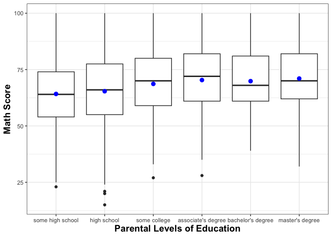

## Description

The purpose of this analysis is to investigate whether the highest level of parental educational attainment has an effect on high school students' mathematics achievement measured by math scores of a standardized test.

## Load data and dependencies


```r
library(data.table)
library(ggplot2)
library(lsr)
```


```r
math_dat <- fread("../data/exams.csv", sep = ",")
```

## Data exploration

We're going to explore the data to gain insights into its features (e.g., number of columns and rows, data types). 


```r
# str() gives me a general idea of the data (e.g., it has 1000 rows and 8 columns)
math_dat[, str(.SD)]
```

```
## Classes 'data.table' and 'data.frame':	1000 obs. of  8 variables:
##  $ gender                     : chr  "female" "male" "female" "male" ...
##  $ race/ethnicity             : chr  "group D" "group D" "group D" "group B" ...
##  $ parental level of education: chr  "some college" "associate's degree" "some college" "some college" ...
##  $ lunch                      : chr  "standard" "standard" "free/reduced" "free/reduced" ...
##  $ test preparation course    : chr  "completed" "none" "none" "none" ...
##  $ math score                 : int  59 96 57 70 83 68 82 46 80 57 ...
##  $ reading score              : int  70 93 76 70 85 57 83 61 75 69 ...
##  $ writing score              : int  78 87 77 63 86 54 80 58 73 77 ...
##  - attr(*, ".internal.selfref")=<externalptr> 
##  - attr(*, ".data.table.locked")= logi TRUE
```

```
## NULL
```


```r
# print top rows
math_dat[, head(.SD)]
```

```
##    gender race/ethnicity parental level of education        lunch
## 1: female        group D                some college     standard
## 2:   male        group D          associate's degree     standard
## 3: female        group D                some college free/reduced
## 4:   male        group B                some college free/reduced
## 5: female        group D          associate's degree     standard
## 6:   male        group C            some high school     standard
##    test preparation course math score reading score writing score
## 1:               completed         59            70            78
## 2:                    none         96            93            87
## 3:                    none         57            76            77
## 4:                    none         70            70            63
## 5:                    none         83            85            86
## 6:                    none         68            57            54
```

### Metadata

Let's refer to the data source and its metadata. This dataset is downloaded from [here](https://www.kaggle.com/datasets/rkiattisak/student-performance-in-mathematics). Based on the metadata, it contains the following features so this seems to line up with what we observed so far in terms of data types (e.g., math score is an integer data type).

* Gender: The gender of the student (male/female)
* Race/ethnicity: The student's racial or ethnic background (Asian, African-American, Hispanic, etc.)
* Parental level of education: The highest level of education attained by the student's parent(s) or guardian(s)
* Lunch: Whether the student receives free or reduced-price lunch (yes/no)
* Test preparation course: Whether the student completed a test preparation course (yes/no)
* Math score: The student's score on a standardized mathematics test
* Reading score: The student's score on a standardized reading test
* Writing score: The student's score on a standardized writing test

For the purpose of this assignment, we will focus on the parental level of education and math score columns since we are interested to know whether parental educational attainment has an impact on math scores among high school students.

### Descriptive statistics

Another way to explore the data is to look at descriptive statistics. For example, this will give us insight into the mean test scores for the different parental level of education.


```r
# get the descriptive stats of each column
math_dat[, as.list(summary(`math score`)), by = `parental level of education`]
```

```
##    parental level of education Min. 1st Qu. Median     Mean 3rd Qu. Max.
## 1:                some college   27      59     70 68.64286    80.0  100
## 2:          associate's degree   28      61     72 70.34804    82.0  100
## 3:            some high school   23      54     64 64.19774    74.0  100
## 4:           bachelor's degree   39      61     68 69.86667    81.0  100
## 5:             master's degree   32      62     70 71.02667    82.0  100
## 6:                 high school   15      55     66 65.38140    77.5  100
```


```r
# calculate sd for each parental level of education
math_dat[, sd(`math score`), by = `parental level of education`]
```

```
##    parental level of education       V1
## 1:                some college 14.55274
## 2:          associate's degree 14.82181
## 3:            some high school 15.73973
## 4:           bachelor's degree 14.26202
## 5:             master's degree 14.18981
## 6:                 high school 15.97146
```


```r
math_dat[, .N, by = `parental level of education`]
```

```
##    parental level of education   N
## 1:                some college 224
## 2:          associate's degree 204
## 3:            some high school 177
## 4:           bachelor's degree 105
## 5:             master's degree  75
## 6:                 high school 215
```

### Missing values

Before moving on, we should also check for missing values in the dataset.


```r
# count number of missing values in each column
math_dat[, lapply(.SD, function(x) sum(is.na(x))), .SDcols = 1:8]
```

```
##    gender race/ethnicity parental level of education lunch
## 1:      0              0                           0     0
##    test preparation course math score reading score writing score
## 1:                       0          0             0             0
```

There are no missing values in this dataset so we don't have to conduct any pre-processing to account for missing values.

### Data pre-processing

There are a few things we should clean up before moving on to visualization and analysis. First, let's change how the columns are named.


```r
# replace space with underscore
new_colnames <- gsub(" |/", "_", names(math_dat))

# replace column names in the data with new_colnames
setnames(math_dat, names(math_dat), new_colnames)

# let's check out the new column names
names(math_dat)
```

```
## [1] "gender"                      "race_ethnicity"             
## [3] "parental_level_of_education" "lunch"                      
## [5] "test_preparation_course"     "math_score"                 
## [7] "reading_score"               "writing_score"
```

Let's change parental level of education to a categorical variable.


```r
# change parental_level_of_education to factors
educ_levels <- c("some high school", "high school", "some college", "associate's degree", "bachelor's degree", "master's degree")

math_dat[, parental_level_of_education := factor(parental_level_of_education, levels = educ_levels)]

# check if this has changed
str(math_dat)
```

```
## Classes 'data.table' and 'data.frame':	1000 obs. of  8 variables:
##  $ gender                     : chr  "female" "male" "female" "male" ...
##  $ race_ethnicity             : chr  "group D" "group D" "group D" "group B" ...
##  $ parental_level_of_education: Factor w/ 6 levels "some high school",..: 3 4 3 3 4 1 4 1 1 5 ...
##  $ lunch                      : chr  "standard" "standard" "free/reduced" "free/reduced" ...
##  $ test_preparation_course    : chr  "completed" "none" "none" "none" ...
##  $ math_score                 : int  59 96 57 70 83 68 82 46 80 57 ...
##  $ reading_score              : int  70 93 76 70 85 57 83 61 75 69 ...
##  $ writing_score              : int  78 87 77 63 86 54 80 58 73 77 ...
##  - attr(*, ".internal.selfref")=<externalptr>
```

From here on wards, we will also work with a subset of the data since we are only focusing on parental level of education and math score.


```r
education_math <- math_dat[, .(parental_level_of_education, math_score)]
```

## Data visualization

We will visualize the math scores for each category of parents' education level using a boxplot. 


```r
# plot boxplot
ggplot(education_math, aes(x = parental_level_of_education, y = math_score)) + 
  geom_boxplot() +
  theme_bw() +
  theme(legend.position="none", 
        axis.title.x = element_text(size=14, face="bold"),
        axis.title.y = element_text(size=14, face="bold")) +
  stat_summary(fun = mean, geom = "point", shape = 20, size = 4, color = "blue", fill ="blue") +
  labs(x = "Parental Levels of Education", y = "Math Score")
```

<!-- -->


## One-way ANOVA

Using a one-way ANOVA, we will determine whether parents' level of education has a significant impact on mean math scores of high school students.


```r
# compute the ANOVA
math.aov <- aov(math_score ~ parental_level_of_education, data = education_math)

# summary of the analysis
summary(math.aov)
```

```
##                              Df Sum Sq Mean Sq F value   Pr(>F)    
## parental_level_of_education   5   6267  1253.5   5.511 5.16e-05 ***
## Residuals                   994 226069   227.4                     
## ---
## Signif. codes:  0 '***' 0.001 '**' 0.01 '*' 0.05 '.' 0.1 ' ' 1
```

Based on this output, parents' level of education has a significant impact on the math scores of high school students. Next, we will calculate the eta squared value to determine the effect size of the ANOVA model.


```r
# calculate eta squared value
etaSquared(math.aov)
```

```
##                                 eta.sq eta.sq.part
## parental_level_of_education 0.02697516  0.02697516
```

The eta squared value ($\eta$^2 = .027) confirmed that the different parental levels of education accounted for 2.70% of the variability in math scores of the students. This effect size is quite small.

Now, we need to perform a post-hoc test to determine pairwise comparisons. For the one-way ANOVA, we will be using the Tukey's HSD post-hoc test.


```r
# run tukey post-hoc test
TukeyHSD(math.aov, conf.level = .95)
```

```
##   Tukey multiple comparisons of means
##     95% family-wise confidence level
## 
## Fit: aov(formula = math_score ~ parental_level_of_education, data = education_math)
## 
## $parental_level_of_education
##                                            diff        lwr       upr     p adj
## high school-some high school          1.1836552 -3.1866650  5.553976 0.9719649
## some college-some high school         4.4451170  0.1146211  8.775613 0.0403236
## associate's degree-some high school   6.1502991  1.7270962 10.573502 0.0010828
## bachelor's degree-some high school    5.6689266  0.3647330 10.973120 0.0281921
## master's degree-some high school      6.8289266  0.8961349 12.761718 0.0133826
## some college-high school              3.2614618 -0.8497052  7.372629 0.2094640
## associate's degree-high school        4.9666439  0.7579359  9.175352 0.0101350
## bachelor's degree-high school         4.4852713 -0.6414204  9.611963 0.1255741
## master's degree-high school           5.6452713 -0.1293729 11.419916 0.0596590
## associate's degree-some college       1.7051821 -2.4621575  5.872522 0.8518793
## bachelor's degree-some college        1.2238095 -3.8689760  6.316595 0.9834947
## master's degree-some college          2.3838095 -3.3607542  8.128373 0.8441831
## bachelor's degree-associate's degree -0.4813725 -5.6532187  4.690474 0.9998209
## master's degree-associate's degree    0.6786275 -5.1361417  6.493397 0.9994571
## master's degree-bachelor's degree     1.1600000 -5.3500911  7.670091 0.9958481
```

The Tukey's HSD post-host test demonstrated significant differences in math scores between the following pairs: 

* some college-some high school
* associate's degree-some high school
* bachelor's degree-some high school
* master's degree-some high school
* associate's degree-high school. 

No significant differences in math scores were found between the following pairs: 

* high school-some high school
* some college-high school
* bachelor's degree-high school
* master's degree-high school
* associate's degree-some college
* bachelor's degree-some college
* master's degree-some college
* bachelor's degree-associate's degree
* master's degree-associate's degree
* master's degree-bachelor's degree.

## Intepretation

* A one-way ANOVA was conducted to examine the effect of parental educational attainment on high school students' math scores in a standardized test. 

* The ANOVA showed that the impact of parents' level of education on high school students' math scores was significant (*F*(5, 994) = 5.511, *p* < .05).

* The eta squared value ($\eta$^2 = .027) confirmed that the different parental levels of education accounted for 2.70% of the variability in math scores of the students. This effect size is quite small.

* A Tukey's HSD post-hoc test revealed that the mean math score of students whose parents completed some high school was significantly different than that of students whose parents completed some college, associate's degrees, bachelor's degrees, and master's degrees (*p* < .05). 

* The post-hoc test also showed that the mean math score of students whose parents completed high school was significantly different than that of students whose parents completed associate's degrees (*p* < .05). 

* No significant differences in math scores were found between high school and some high school, some college and high school, bachelor's degree and high school, master's degree and high school, associate's degree and some college, bachelor's degree and some college, master's degree and some college, bachelor's degree and associate's degree, master's degree and associate's degree, and master's degree and bachelor's degree (*p* > .05).

The end.
